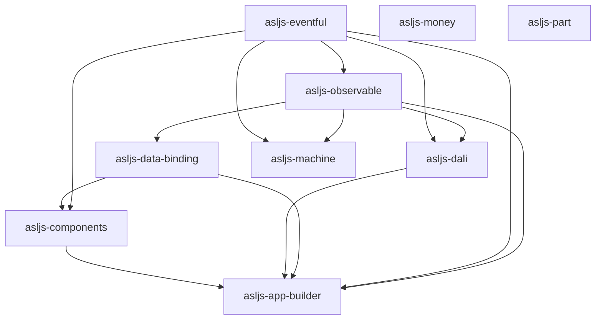

# asljs

Alexandrite Software Libraries for JavaScript (asljs) provides essential
utilities and functions to improve everyday development.

Libraries:

- [components](components) - reusable web components.
- [data-binding](data-binding) - declarative DOM bindings via `data-model`.
- [dali](dali) - IndexedDB data layer with typed table abstractions.
- [eventful](eventful) - adds on/off/emit to any object.
- [machine](machine) - provides a state-machine framework for organizing control
  flow.
- [money](money) - provides utilities for handling monetary values.
- [observable](observable) - makes any object emit events on property changes.
- [tmpdir](tmpdir) - provides temporary directory utilities for testing and
  development.

Tools:

- [cog](cog) - AI agents context manager.
- [part](part) - defines project artefacts in markdown and validates them with
  CLI rules.
- [sfmt](sfmt) - JS/TS code formatter.

Applications:

- [app-builder](app-builder) - a demo application that uses the libraries to
  build a simple app with AI-assisted features.

## Architecture

The monorepo is organized as small packages with explicit workspace boundaries.
Published libraries expose a single package-root entrypoint through
`package.json#exports`. Internal source files remain implementation details
unless a package README states otherwise.

### Package dependency graph

