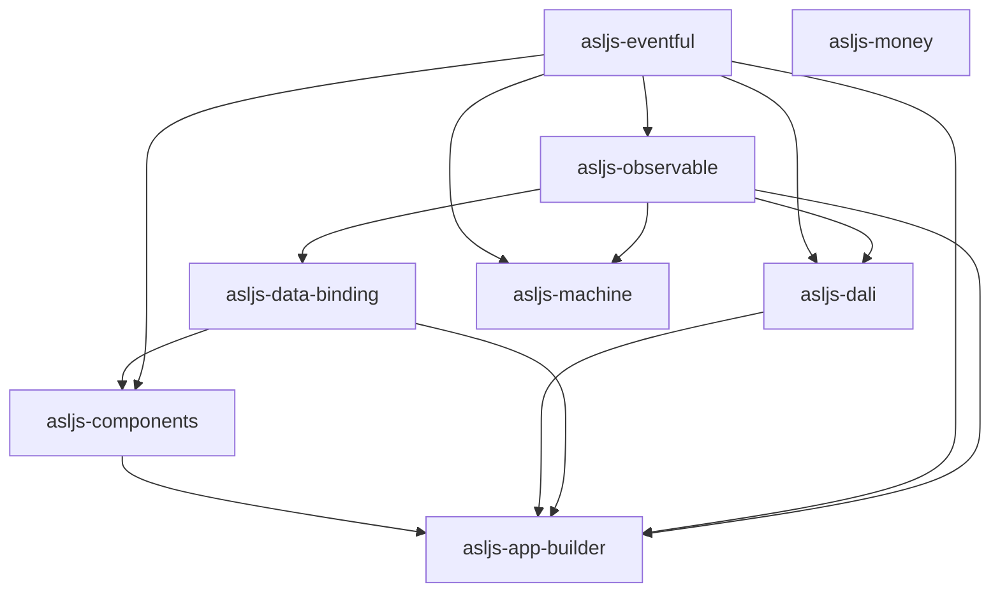

# Overview

Alexandrite Software Libraries for JavaScript (asljs) provides essential
utilities and functions to enhance everyday JavaScript development.

Live demo:

- [ASLJS App Builder](https://alexandritesoftware.github.io/asljs/app-builder/)

Libraries:

- [components](components) - reusable web components.
- [data-binding](data-binding) - declarative DOM bindings via `data-model`.
- [dali](dali) - IndexedDB data layer with typed table abstractions.
- [eventful](eventful) - adds on/off/emit to any object.
- [machine](machine) - provides a state-machine framework for organizing
  control flow.
- [money](money) - provides utilities for handling monetary values.
- [observable](observable) - makes any object emit events on property changes.

## Architecture

The monorepo is organized as small packages with explicit workspace boundaries.
Published libraries expose a single package-root entrypoint through
`package.json#exports`. Internal source files remain implementation details
unless a package README states otherwise.

### Package dependency graph

### Public API boundaries

- `asljs-eventful`: Event helpers and base types are exported from the root
  package.
- `asljs-observable`: Observable wrappers, object base class, and types are
  exported from the root package.
- `asljs-data-binding`: `bindDataModel`, built-in pipe creation, and public
  types are exported from the root package.
- `asljs-components`: `AssistedInput`, `Button`, `ButtonAdd`, `ButtonDelete`,
  `createBootstrapTheme`, `FileView`, `Keyboard`, `Letterpad`, `List`,
  `Numpad`, `TextInput`, handler factories, theme helpers, and related types
  are public; component internals are not.
- `asljs-dali`: Table, live views, strategies, transactions, event-source,
  and saga exports are public from the root package.
- `asljs-machine`: The public surface is the `machine(...)` factory and its
  declared types.
- `asljs-money`: The public surface is the `money` factory plus `Money` and
  `MoneyFactory` types.
- `asljs-app-builder`: No library API. This is an app/demo package;
  `src/app-builder/*` modules are internal.

### Package roles

| Package | Browser-only | Framework-agnostic | Demo/app package | Publishable library |
| --- | --- | --- | --- | --- |
| `asljs-eventful` | No | Yes | No | Yes |
| `asljs-observable` | No | Yes | No | Yes |
| `asljs-data-binding` | Yes | Yes | No | Yes |
| `asljs-components` | Yes | Yes | No | Yes |
| `asljs-dali` | Yes | Yes | No | Yes |
| `asljs-machine` | No | Yes | No | Yes |
| `asljs-money` | No | Yes | No | Yes |
| `asljs-app-builder` | Yes | No | Yes | No |

### Placement guidance

- Put generic event APIs in `eventful`.
- Put change-tracking and path watching in `observable`.
- Put DOM binding syntax and binding runtime behavior in `data-binding`.
- Put browser UI components in `components`.
- Put IndexedDB storage, live table views, and transaction helpers in `dali`.
- Put control-flow state machines in `machine`.
- Put monetary value and currency logic in `money`.
- Put demo-specific or AI-assisted app behavior in `app-builder`.

If a feature could live in more than one package, prefer the lowest-level
package that can own it without taking on browser-specific or demo-specific
concerns.
