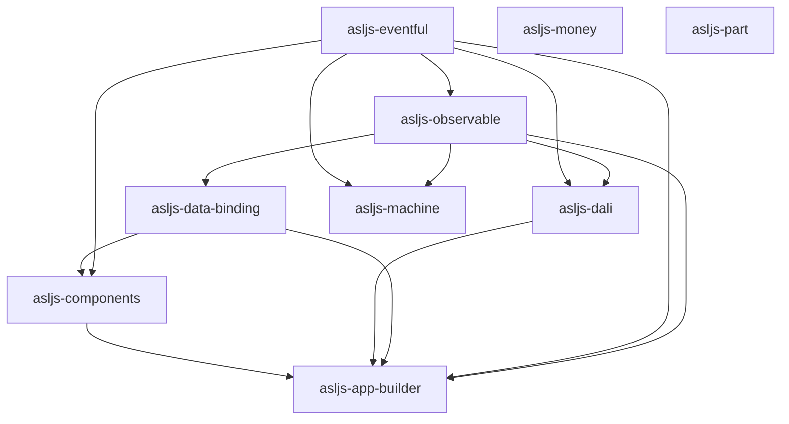

# Dependencies

```mermaid
graph TD
  eventful[asljs-eventful]
  observable[asljs-observable]
  databinding[asljs-data-binding]
  components[asljs-components]
  dali[asljs-dali]
  machine[asljs-machine]
  money[asljs-money]
  part[asljs-part]
  appbuilder[asljs-app-builder]

  eventful --> observable
  observable --> databinding
  databinding --> components
  eventful --> components
  eventful --> dali
  observable --> dali
  eventful --> machine
  observable --> machine
  components --> appbuilder
  dali --> appbuilder
  databinding --> appbuilder
  eventful --> appbuilder
  observable --> appbuilder
```
