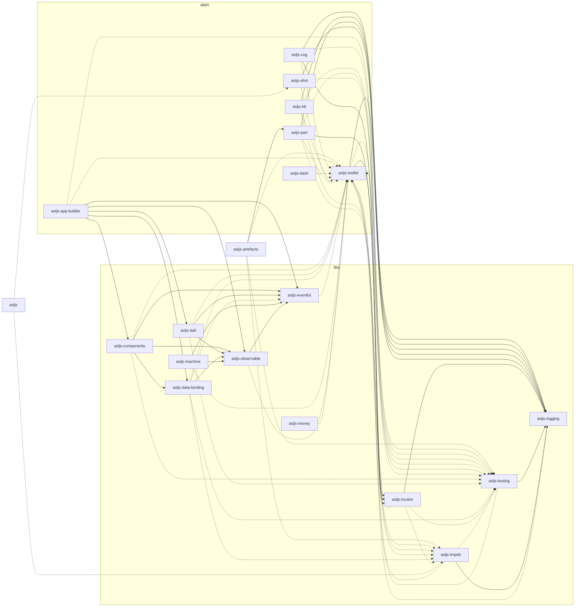

# Dependencies

How the workspace packages depend on each other: solid edges for `dependencies`,
dotted edges for `devDependencies`. The graph is generated from the `NPM
Package` artefacts of `asljs-part`, starting from the root `package.json` and
its workspaces:

```pwsh
npm -w asljs-part run build:dist
npx part diagram --definitions "asljs-part;NPM Package" docs/Dependencies.md --write
```

`--check` in place of `--write` fails when the graph below is out of date.

## Nodes

- Definitions: NPM Package
- Label: Name

## Root

- Artefacts: package.json
- Follow: Workspaces

## Edges

### Workspaces

- Style: invisible

### Dependencies

### DevDependencies

- Style: dotted

## Layout

- Direction: LR
- Group: folder

## Diagram



## Overrides

`glob` is pinned to `^13.0.6` across the whole tree by `overrides` in the root
`package.json`.

The four packages that use it directly, `cog`, `kb`, `part` and `sfmt`, already
ask for that major. `remark-validate-links`, which `flint` runs, reaches
`glob@^10` through `unified-engine` and again through `@npmcli/config`, and
version 10 is deprecated, so `npm i` printed one deprecation warning per path.

There is no upgrade to take instead: `remark-validate-links@13.1.0` and
`unified-engine@11.2.2` are the current releases, and `unified-engine` still
asks for `^10`. All three consumers import only `glob` and `hasMagic`, both
still exported by 13, which is why forcing the major is safe here.

Remove the override once `unified-engine` and `@npmcli/config` move off
`glob@10`.
