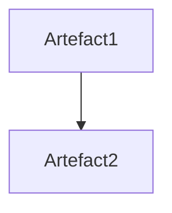

# RQ121 CLI Inventory action

Inventory command enumerates all files and folders in the project folder and
for each of them lists all artefact definitions that apply to it.

Parameters:

- `--inventory-definitions=...` - limit check to specific definitions,
  comma-separated list.
- `--format=...` - output format, either `table` (default), `diagram`, or
  `json`.
- `--with-properties` - optional comma-separated list of definition properties
  `<Definition>.<Property>,...`.

See also:

- [RQ111 CLI Definitions parameter][1]

[1]: <RQ111 CLI Definitions parameter.md>

## Report Properties

The produced report starts with these columns:

- `Location` - file or folder path, relative to the working directory.
- `Definitions` - comma-separated list of all definitions that apply to the
  artefact.

When `--with-properties` is specified, additional columns are added for each
property requested, with the column name `<Definition>.<Property>`.

When `--with-properties` is provided as a list of properties, the report will
include only those properties for the definitions that apply to each artefact.

### Example: Report with two columns

```pwsh
part inventory --with-properties=Definition1.Property1,Definition2.Property1
```

Should produce a report with the following columns:

- `Location`
- `Definitions`
- `Definition1.Property1`
- `Definition2.Property1`

### Example: Report with all properties

```pwsh
part inventory --with-properties
```

### Example: Report with no properties

```pwsh
part inventory
```

## Report Formats

### `table`

The default format is a Markdown table, with one row per artefact and one
column per property requested.

```markdown
| Location | Definitions | Definition1.Property1 | Definition2.Property1 |
|----------|-------------|-----------------------|-----------------------|
| ...      | ...         | ...                   | ...                   |
```

### `json`

The `json` format produces a JSON array of objects, one per artefact.

```json
[
  {
    "Location": "...",
    "Definitions": [ "...", ... ],
    "Properties": {
      "Definition1": { "Property1": "...", ... },
      "Definition2": { "Property1": "...", ... }
    }
  },
  ...
]
```

### `diagram`

The `diagram` format produces a Mermaid diagram, with one node per artefact and
one edge per property linking to another artefact, if it is on the diagram.


